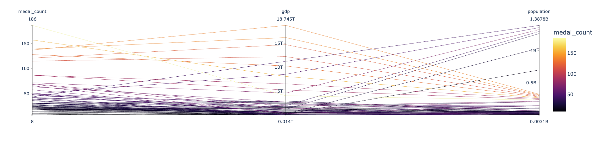

# Project Title

Olympic Trend Analysis

# Project Description

In this project, we are tryig to analyze historical data of olympics and analyze different trends on the data. Some of questions we are trying to answer are:

1. Find trend for how highest number of  winner of medals by country have changed across the history
2. Find trend of top 5 sports where USA has won the most number of gold over the years
3. Find the relationshiop of population, gdp and medal count. Does more population and gdp mean more medal count ? 
4. Find trend on age of Male and Female Atheletics
5. Determine if hosting the Olympics results in improved performance by the hosting country in the games. 

# Team Members

- Chris Contos
- Manish Rajkarnikar
- Abdullahi Osman

# Data Description

We are using 2 sources of data 

### Kaggle
Using kaggle we were able to go to historical dataset[0] on the modern Olympic Games, including all the Games from Athens 1896 to Rio 2016.
We used kaggle again to get lat and long information of host cities. 

### Worldbank
Worldbank DataBank[1] contains collections of time series data on a variety of topics on various countries. We can create our own queries; generate tables, charts, and maps; and easily save, embed, and share them. We use Worldbank DataBank API interface of to extract information such as population and gdp of various countries throughout the history

# How to run the project

In order to run the project, we should be able to run notebook named manish.ipynb and chris.ipynb  

We also have created a dashboard to put all the slides together. That code is in dashboard.ipynb

# Find trend for how highest number of  medal winners by country have changed across the history

kaggle[0] provides information of all the atheletics that participated in the olympics. It contains information such as their name, the country they are from, medal they won and the sport in which they won the medal in and also the year in the medal was won. Using this information we were able to find the number of medals each country won and rank the top twenty countries who won the most number of medal in each olympics. Using this information we were then able to plot the following animation to find a trend for how highest number of  winner of medals by country have changed across the history

From the above chart we can conclude that USA did not use to be leader when the olypmics started.
* US started being dominant since the 1920s.
* Early competitors where countries like european countries like Sweden, Belgium, Italy, France .
* From 1950s Russia started being the competitor
* China started doing better since 2000

# Find trend of top 5 sports where USA has won the most number of gold over the years

We were able to tap into kaggle data[0] again to group number of medal won in various years  filtered it only for  USA. We wanted to see what were the top 5 sports where USA has won the most number of gold over the years. 

Above diagram show that overall US has been winning most of the medals in this order
1. Swimming
2. Atheletics 
3. Basketball
    
US used to win a lot in rowing also. Lately, we can see a trend that football is another sport where US has been getting a lot of medals from.

# Find the relationshiop between population, gdp and medal count. Does more population and gdp mean more medal count ? 

We were interested in finding if gdp and population of country have any effect on the number of medals won in olympics. In other words, we wanted to find the relationshiop of population, gdp and medal count. kaggle data[0] did not have any population or gdp information. So we can find another source for that data. We found that world bank API provided that data. But the data went as far back as 1971 only. We then took subset of data from kaggle and joined this information with world bank data and were able to plot a diagram below

This diagram showed us  that small countries and small population usually mean less number of medals. But not necessary all the time. You can see that few countries like india and china(in the past) could not get many medal despite having larger population.  

# Find trend on age of Male and Female Atheletics

As for age trend, we see very consistent pattern where male and female age is around mid 20s throughout the history.

# Determine if hosting the Olympics results in improved performance by the hosting country in the games. 

We wanted to first display the locations of each of the Modern Olympic Games as a point of reference, so we downloaded, imported and used mapplotlib to map and display an interactive map of the host cities and countries. 

We then looked for a pair of host countries that participated in at least 3 sets of Winter Olympics prior to and post their hosting of the games. We settled on France in 1992 and Norway in 1994.

## France 1992, Alberville

## Norway 1994, Lillehammer

In both instances, the hosting country out performed in overall medal during the games they hosted compared to the prior 3 sets of games.
The out performance continued for both countries in at least 2 of the following 3 games.
(note Norway)
Based on this small sampling we feel there is a basis for a larger more in-depth study of the advantages for hosting countries of the Olympics.

# Summary

Overall we found  a lot of trends; some expected and some unexpected. Expected were things like US domination in olympics, effect of population, gdp, hosting of olympics. 

Some interesting and surprising things were, how events where US has been winning are changing. Eg women soccer is now a field where US has been getting more medals from. Other trends we found are also how closely socio political situation of country affects the overrall medal count. Eg germany was top country in 1936, Russia was really good 1950s-1990s.
and now china is picking up. Whereas, countries like italy are doing poor now. So we can conclude that there are lots of interesting trends  worth in-depth study.  

## References:
[0] https://www.kaggle.com/heesoo37/120-years-of-olympic-history-athletes-and-results

[1] https://databank.worldbank.org/indicator/NY.GDP.MKTP.CD/1ff4a498/Popular-Indicators

[2] https://www.kaggle.com/jonscheaffer/olympic-host-cities